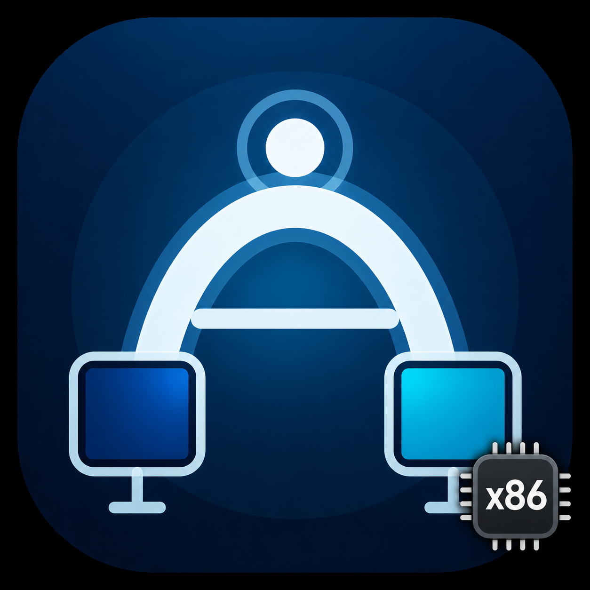

# TargetBridge Intel Sender

TargetBridge Intel Sender is an independent `x86_64` Sender fork of
[TargetBridge](https://github.com/swellweb/targetBridge), maintained by
**AndyStuardo**. It lets an Intel Mac create a virtual display and present it on
another Mac running the TargetBridge Receiver, with Thunderbolt Bridge as the
preferred transport.



The fork began with a specific setup: reuse a 21.5-inch 4K Intel iMac running
macOS Monterey as an extended display for a 27-inch 5K Intel iMac from 2020
running macOS Sequoia. The work remains useful outside that pair, but only the
configurations listed in [Compatibility](docs/Compatibility.md) should be
treated as verified.

> Status: `3.3.0-intel.1` prerelease candidate. The Intel Sender is usable on
> the validated hardware, but the downloadable package is not yet signed with
> a Developer ID or notarized by Apple.

## Why this fork exists

The upstream Sender was documented and packaged for Apple Silicon. This fork
keeps the protocol and the original Receiver intact while adding a separately
packaged Intel Sender and the diagnostics needed to tell whether an Intel Mac
can capture and encode the selected display reliably.

The application is deliberately isolated from the original installation:

- application name: `TargetBridge Intel Sender.app`
- architecture: thin `x86_64`
- bundle identifier: `com.targetbridge.intel-sender`
- URL scheme: `targetbridge-intel`
- preferences, logs and Application Support data owned by the Intel variant
- safe `uninstall.sh` which targets only those Intel-variant files

It does not replace or remove TargetBridge Receiver, AirDisplay, Thunderbolt
Bridge settings, Wi-Fi configuration or the upstream TargetBridge app.

## Intel fork additions and adaptations

- Intel-native Sender build and packaging.
- 4K-oriented `Work 4K` profile plus logical HiDPI modes `2048 x 1152` and
  `2304 x 1296`.
- Hardware VideoToolbox probing and live telemetry for codec, encoder, hardware
  status, fallback, FPS, bitrate, resolution and errors.
- H.264 and HEVC operation verified on the 2020 Intel iMac.
- Optional RAW NV12 transport when both ends advertise support. This remains
  experimental because its uncompressed bandwidth and memory-copy cost can be
  greater than its codec-latency saving.
- Better Thunderbolt Bridge recognition without changing network services or
  disabling Wi-Fi.
- Quick controls in one menu-bar item: displays, Receivers, duplicate/extended
  mode, profiles, codec state and brightness.
- Spanish localization, automatic language selection and English fallback.
- Optional launch at login and login-only reconnection. Opening the app
  manually does not trigger automatic connection.
- Attached settings and telemetry panels, improved first-use connection action,
  and user-facing `Display/Pantalla` terminology while the protocol continues
  to use `session` internally.
- A distinct petroleum-blue `x86` application icon. The functional menu-bar
  icon remains unchanged.

## Inherited TargetBridge capabilities

The following capabilities are retained from upstream TargetBridge. They are
included in this fork because they remain part of the Sender workflow, but are
not presented as original Intel-fork development:

- Cable Test throughput measurement and guided connection diagnostics.
- Duplicate and Extended Desktop streaming modes.
- Thunderbolt Bridge transport, experimental Network Link, and multi-Receiver
  sessions.
- Audio Relay, Input Dockstation, remote brightness, translations and the
  shared Sender/Receiver protocol.

The Intel fork adapts the presentation, terminology, packaging and
compatibility reporting around these features where necessary. Detailed
upstream authorship remains available in the Git history and original project.

## Verified setup and results

| Role | Hardware and software |
|---|---|
| Sender | iMac Retina 5K 27-inch (2020), Intel Core i5 3.3 GHz, Radeon Pro 5300, macOS Sequoia 15.7.7 |
| Receiver | iMac Retina 4K 21.5-inch, Intel, macOS Monterey, unchanged upstream Receiver |
| Link | Thunderbolt Bridge, `10.0.0.1` to `10.0.0.2` through `bridge0` |
| Toolchain | Xcode 26.3 (17C529) |

The minimal Debug build, Release package and unit-test suite all complete as
`x86_64`. The VideoToolbox probe created hardware-required H.264 GVA and HEVC
AVE compression sessions at both prioritized logical resolutions. A real
end-to-end session subsequently reached a 4096 x 2304 HEVC stream at 30
delivered FPS.

See [Intel Sender audit](docs/Intel-Sender-Audit.md) for the exact findings and
[machine-readable VideoToolbox evidence](docs/evidence/videotoolbox/imac-2020-sequoia-15.7.7.json)
for the probe output.

## Install and connect

The Receiver is not repackaged by this fork. Install the suitable Receiver from
the [original TargetBridge releases](https://github.com/swellweb/targetBridge/releases)
on the destination Mac, then follow:

- [Quick start — Español](docs/QuickStart-ES.md)
- [Quick start — English](docs/QuickStart-EN.md)

To build the Intel Sender locally:

```bash
TargetBridge-Sender/scripts/build_intel_sender_app.sh
```

The result is `build-intel/TargetBridge Intel Sender.app`. Copy it to
`/Applications` without replacing the original TargetBridge installation.

## Compatibility direction

Sender and Receiver are roles, not fixed hardware directions. An Intel Mac can
send to an Apple Silicon Mac if the latter runs a compatible arm64 Receiver.
The shared protocol does not prohibit that arrangement, but it has not yet been
verified by this fork. Conversely, the upstream Apple Silicon Sender can use an
Intel Receiver; that remains an upstream workflow.

The Intel Sender is currently a thin `x86_64` application. It may launch on
Apple Silicon through Rosetta 2, but that is not the same as native arm64
support. Planned M1 tests are tracked in [Compatibility](docs/Compatibility.md)
and must be completed before making broader claims.

## Documentation

- [Documentation map](docs/README.md)
- [Features and controls](docs/Features.md)
- [Hardware and Thunderbolt Bridge](docs/Hardware.md)
- [Compatibility and test matrix](docs/Compatibility.md)
- [Testing and reporting results](docs/Testing.md)
- [Audit and viability report](docs/Intel-Sender-Audit.md)
- [Release and packaging process](docs/Release-Process.md)
- [Automation](docs/Automation.md)
- [Add-ons](docs/Addons.md)
- [Translations](docs/Translations.md)
- [Safe uninstall script](uninstall.sh)

The inherited guides are maintained where the underlying feature still exists.
They may be corrected and extended for this fork; they do not need to remain
word-for-word copies of upstream documentation. When behavior applies only to
the upstream Apple Silicon Sender or only to the Intel fork, the page should say
so explicitly.

## Security, privacy and network behavior

TargetBridge Intel Sender requests Screen Recording because it must capture the
display it sends. Input or audio add-ons can require additional macOS
permissions. The app does not store Receiver login credentials and does not
bypass the Lock Screen or FileVault.

It reads available network interfaces and binds the selected local address. It
does not assign IP addresses, change subnet masks or routers, reorder network
services, disable Wi-Fi, or combine multiple Thunderbolt cables into one stream.

## License and attribution

TargetBridge Intel Sender is based on the MIT-licensed TargetBridge project by
Marco Caciotti (`swellweb`) and its open-source community. The Intel fork is
developed and maintained by AndyStuardo. The original copyright and license
notice in [LICENSE](LICENSE) are preserved.

The `x86` badge is this fork's compatibility marker. It does not use the Intel
corporate logo and does not imply sponsorship or endorsement by Intel.
